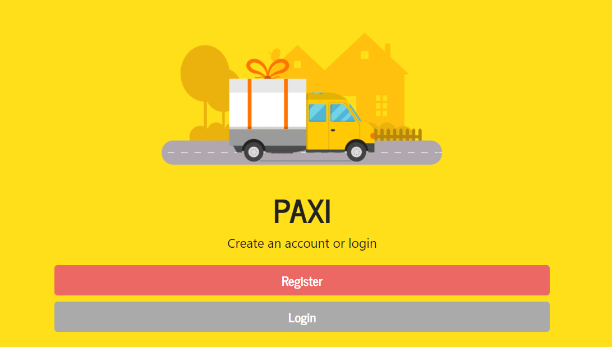
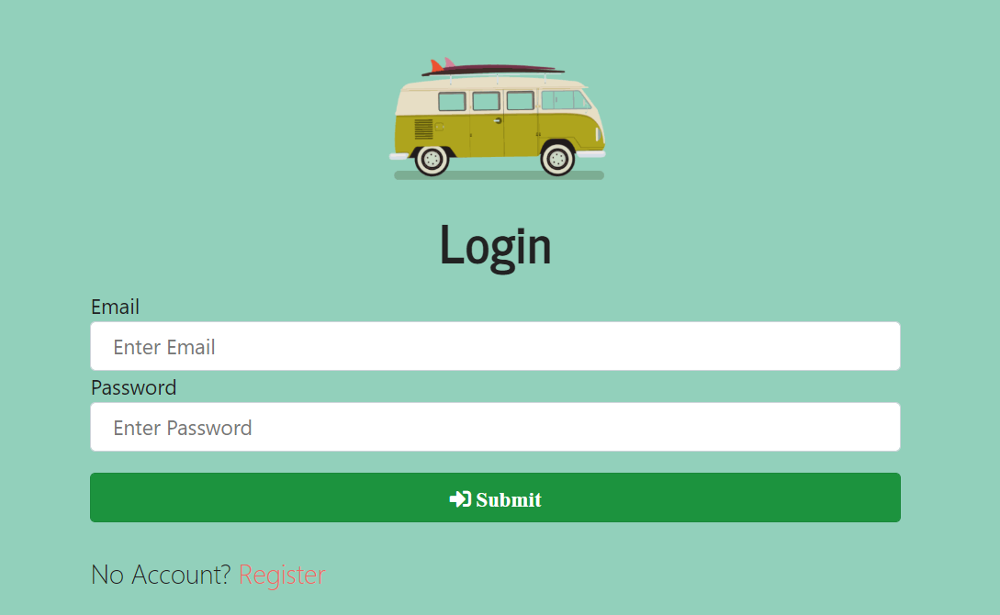
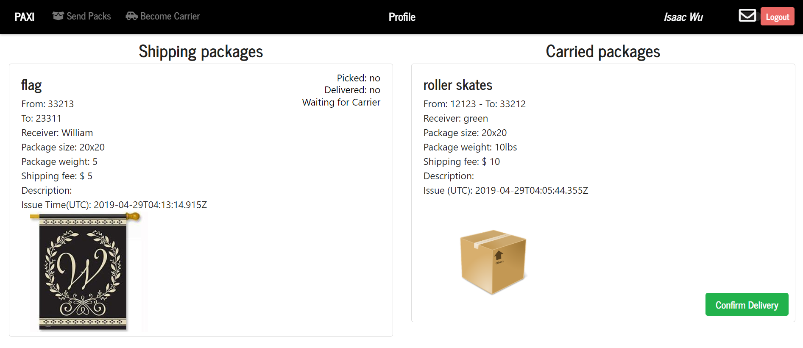
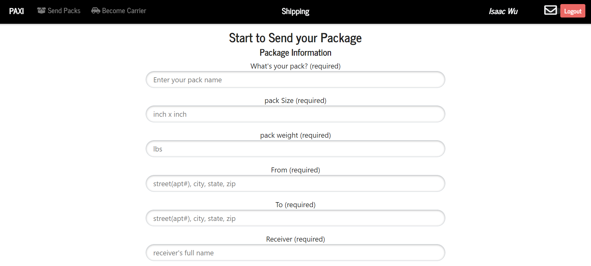
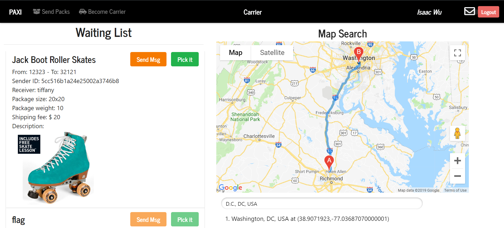
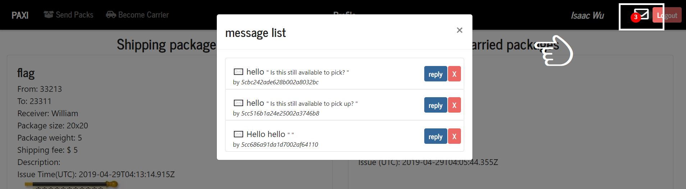

# 📦 PAXI

#### PAXI is a new mode package delivery app. Anytime, Anywhere, and Any price are three main differences from the traditional express business such as UPS or DHL

1.	Speed. Normally, the shipping company do one to two shippment per day, and the shipping process will last for 2 to 7 busniess days. PAXI ships at anytime you prefer.
2.	Location. We don’t have a store location. Customers ship their packages at anywhere they like. It feels like call a taxi to deliver your package.
3.	Price. All the popular express companies operating the business with B2C mode. However, PAXI use C2C business mode which means we give users less limit but more authority to customize their packages, the user can even price their shipping fee up to how faster their desire to ship.
###

* 👉 Click  [>>> HERE <<<](https://paxi-express.herokuapp.com/)   to check app demo
#


<!-- -->

### 📦 Profile Page
```
This profile page displays current user's Shipping Account (left side), Carrier Account (right side).
- Shipping Account allow user to track his/her shipping package status by if Picked/Delivered, and carrier info.
- Carrier Account allow carrier to confirm delivered when delivery complete.
```


### 📦 Shipping Page
```
This shipping page supply the current user a shipping form.
Complete the form will post the shipping item/package to carrier page which all registered carriers can see/pick it.
```


### 📦 Carrier Page
```
This carrier page allow all registered carriers to find their ideal delivery jobs.
Carriers can choose to pick packages or send messages to package holders.
Carriers can check the direction through Google Map.
```


### 📦 Message Box
```
All new messages will be noticed at each page's navbar.
User can reply or delete messages all the time.
```

3. Message Inbox (nav bar)

#### 🚛Technologies
- [x] MongoDB Mongoose
- [x] Node Express
- [x] React
- [x] Google Map API
- [x] JavaScript
- [x] CSS/Bootstrap
- [x] Passport/Bcrypt


#### 🚛 Local Install

* `git clone` or download from github
* `npm i` in root, install npm packages
* `npm start` to start node server and react server
* open browser and load http://localhost:3000/

#### 📬 Author

[Isaac Wu](https://github.com/squall2046)

## Copyright
© 2019 All Rights Reserved
